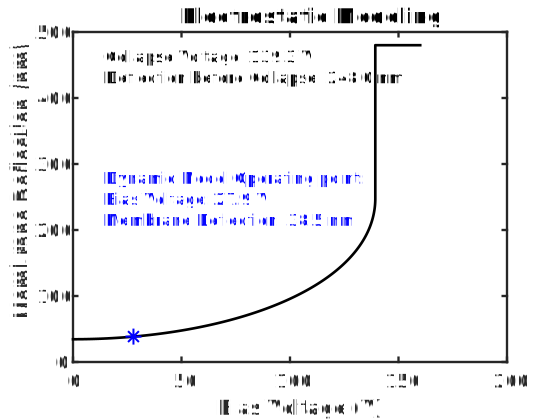
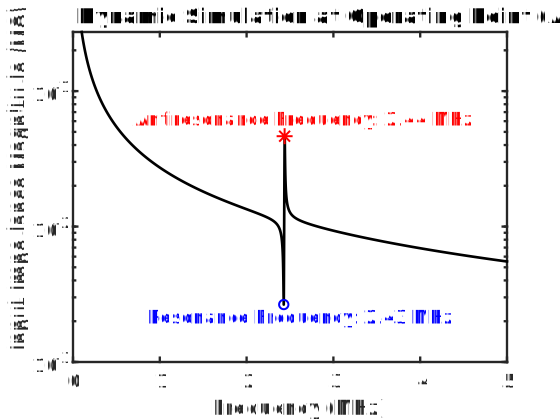
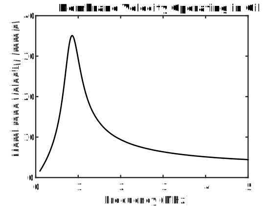
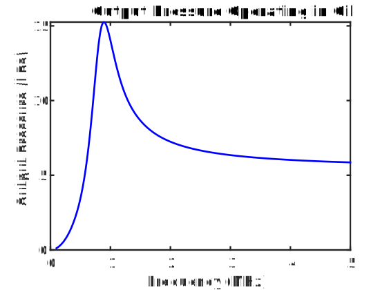
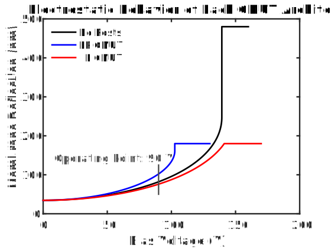
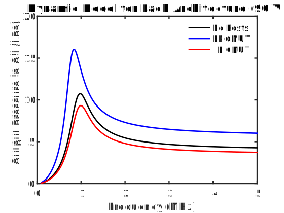

# RCMUTModel – Analytical Modeling of CMUTs with Long Rectangular Membranes

`RCMUTModel` is a set of functions used to rapidly model the electrostatic and dynamic behavior of capacitive micromachined ultrasound transducers (CMUTs) with rectangular membranes. This program is provided as a companion to our manuscript which details our analytical modeling approach. The source code, documentation, and example scripts were written by Eric B. Dew.

## Table of Contents
1. [Motivation](#motivation)
2. [Installation Instructions](#installation-instructions)
3. [Example Usage](#example-usage)
4. [Citing This Work](#citing-this-work)


## Motivation
Capacitive micromachined ultrasound transducers (CMUTs) are devices used to detect and transmit ultrasound. These devices have been studied extensively due to their advantages over other transducer technologies. The traditional approach to developing CMUTs involves a large number of small membranes vibrating together to detect and transmit ultrasound. However, [recent works](https://www.nature.com/articles/s41378-022-00392-0) have demonstrated that CMUTs with a single long rectangular membrane may provide better output pressure than standard designs. Moreover, including electrode posts in the CMUT cavity has been shown to improve both performance and reliability in these CMUTs. These promising results motivate further work seeking to optimize and understand this new method for designing CMUTs.

Although finite element models can be applied to study these new technologies, analytical models offer deeper insights into the underlying device physics along with much faster computation times. Our paper introduces an analytical method to predict the behavior of rectangular CMUTs, and a framework to model the impact of electrode posts. This program implements these analytical techniques into easy-to-use MATLAB functions such that other researchers may benefit from our analysis and rapidly simulate rectangular CMUTs. We hope that this program facilitates better understanding of CMUT design and enables better ultrasound transducers to be developed in the future.

## Installation Instructions
Our `RCMUTModel` library has been developed for MATLAB R2023b. To use these functions, simply clone our repository or download the files, and move the project folder into your MATLAB directory. To run the tutorial scripts, ensure that the :file_folder:[/Tutorials](Tutorials) subfolder is within the MATLAB search path. To use our functions outside of the sample scripts provided, ensure that the :file_folder:[/Code](Code) subfolder is within the MATLAB search path. Moving any of the :file_folder:[/Code](Code), :file_folder:[/Data](Data), or :file_folder:[/Tutorials](Tutorials) subfolders outside of the project folder will prevent the program from working properly. Our program does not rely on any other toolboxes or libraries.

## Example Usage
These examples outline the basics of using this program. Detailed tutorial and example scripts are available in the :file_folder:[/Tutorials](Tutorials) subfolder. **Important: Ensure the :file_folder:[/Code](Code) subfolder is added to MATLAB's search path before running these examples.** For the examples which reproduce results from our manuscript, also ensure that :file_folder:[/Data/Figures](Data/Figures) is added to the search path.

### Example 1: Using the `RCMUTModel()` function
The basic method of using our program involves calling the `RCMUTModel()` function with name-value parameters that correspond to each design parameter of your device. Each parameter has a default value so it is only necessary to input parameters which are being changed from their default values. A list of all of these parameters and their corresponding default values can be viewed using `doc RCMUTModel`, while the most commonly used parameters can be viewed using `temp = RCMUTModel();temp.BasicParams`. These name-value parameters are typically consistent with the conventions used in our manuscript.
```matlab
%Call RCMUTModel with Device Parameters, outputs a structure of simulation results
SimResults = RCMUTModel("a",60e-6, ... %Membrane half-width [m]
    "b",1500e-6,... %Membrane half-length [m]
   "h", 4.9e-6,... %Membrane thickness [m]
   "d0",480e-9,... %Cavity vacuum gap [m]
   "di",360e-9,... %Insulating layer thickness [m]
   "epsr",3.9, ... %Relative permittivity of dielectric layer
   "E",148e9, ... %Young's modulus of membrane [Pa]
   "rho",2329, ... %Density of membrane [kg/m^3]
   "h_metal",250e-9, ... %Electrode thickness [m]
   "E_metal",76e9, ... %Young's Modulus of metal electrode [Pa]
   "rho_metal",19300 ... %Density of metal electrode [kg/m^3]
   ); 
```
The `RCMUTModel()` function then returns a structure containing the simulated results. This includes both electrostatic and dynamic model data.
```matlab
figure %Plot Electrostatic results
plot(SimResults.VDC,SimResults.w0*1e9,'k','LineWidth',2) %membrane deflection as a function of bias voltage
xlabel('Bias Voltage (V)');ylabel('Membrane Deflection (nm)');ax1 = gca;ax1.FontSize = 14;ax1.LineWidth = 1.75;title('Electrostatic Modeling')
text(SimResults.Vc/10,max(SimResults.w0)*1e9,...    
sprintf('Collapse Voltage: %.1f V\nDeflection before Collapse: %.1f nm',SimResults.Vc,SimResults.wPI*1e9),"FontSize",12,'VerticalAlignment','top')
```
CMUTs are operated with a bias voltage, which then corresponds to a static membrane deflection. The static model is used to determine the conditions at a given operating point, after which dynamic simulations are performed. This is explained in more detail in [/Tutorials/Tutorial1BasicFunctions.mlx](Tutorials/Tutorial1BasicFunctions.mlx). By default, CMUT operation is simulated at 20%, 50%, 80% and 95% of the collapse voltage.
```matlab
hold on %Plot the first operating point on electrostatic curve
plot(SimResults.Vop(1),SimResults.wop(1)*1e9,'*',"Color",'b','MarkerSize',10,'LineWidth',1.5)
text(SimResults.Vc/10,SimResults.wPI*1e9,...
sprintf('Dynamic Model Operating point:\nBias Voltage: %.1f V\nMembrane Deflection: %.1f nm',SimResults.Vop(1),SimResults.wop(1)*1e9),"FontSize",12,"Color",'b')

figure %Plot input impedance magnitude as a function of frequency for the first operating point (default: air medium)
semilogy(SimResults.f{1}/1e6,abs(SimResults.Zin{1}/1e6),'k','LineWidth',2)
xlabel('Frequency (MHz)');ylabel('Input Impedance Magnitude (MΩ)');ax1 = gca;ax1.FontSize = 14;ax1.LineWidth = 1.75;title('Dynamic Simulation at Operating Point (Air)')
fr = SimResults.fr(1); Zfr = SimResults.Zin{1}(SimResults.f{1} == fr); %Obtain resonance frequency and corresponding input impedance
fa = SimResults.fa(1); Zfa = SimResults.Zin{1}(SimResults.f{1} == fa); %Obtain antiresonance frequency and corresponding input impedance
hold on;plot(fr/1e6,abs(Zfr/1e6),'o',"Color",'b','MarkerSize',7,'LineWidth',1.5);plot(fa/1e6,abs(Zfa/1e6),'*',"Color",'r','MarkerSize',10,'LineWidth',1.5)
text(fr/1e6,abs(Zfr/1e6),sprintf('Resonance Frequency: %.2f MHz',fr/1e6),"FontSize",14,'VerticalAlignment','top','HorizontalAlignment','center',"Color",'b')
text(fa/1e6,abs(Zfa/1e6)*1.1,sprintf('Antiresonance Frequency: %.2f MHz',fa/1e6),"FontSize",14,'VerticalAlignment','Bottom','HorizontalAlignment','center',"Color",'r')
```

<p align="center">
  
&nbsp;
  
</p>

Figures generated by running this example.
### Example 2: Using the `edrc()` function & custom acoustic media
When it is necessary to control many device parameters, using `RCMUTModel()` can be quite cumbersome. For this reason, we defined the `edrc()` function, which is called with a structure containing each parameter and its corresponding value. This example shows how the edrc function can be used to simulate the device from [Example 1](#example-1-using-the-rcmutmodel-function) with a custom fluid medium
```matlab
CMUT = struct; %structure of device/simulation parameters
%Dimensions:
CMUT.h = 4.9e-6; %Membrane thickness [m]
CMUT.d0 = 480e-9; %Cavity vacuum gap [m]

%Soybean oil medium:
CMUT.UseCustomFluidMedium = 1; %1 = enabled, 0 = disabled. Default - Disabled.
CMUT.FluidDensity = 920.29; %Custom fluid medium density [kg/m^3]
CMUT.FluidSpeedOfSound = 1484.1; %Custom fluid medium speed of sound [m/s]

CMUT.VAC = 2; %Amplitude of driving sinusoidal signal [V]

SimResults = edrc(CMUT);

%Plot Membrane RMS Average Velocity Magnitude @ 80% of collapse voltage:
figure;plot(SimResults.f{3}/1e6,abs(SimResults.vRMS{3})*1e3,'k','LineWidth',2) 
xlabel('Frequency (MHz)');ylabel('Membrane Velocity (mm/s)');ax1 = gca;ax1.FontSize = 14;ax1.LineWidth = 1.75;title('Membrane Velocity Operating in Oil')
%Plot Magnitude of RMS Average Pressure Applied to Acoustic Medium (@ 80% of Vc):
figure;plot(SimResults.f{3}/1e6,abs(SimResults.Pout{3}/1e3),'b','LineWidth',2)
xlabel('Frequency (MHz)');ylabel('Output Pressure (kPa)');ax1 = gca;ax1.FontSize = 14;ax1.LineWidth = 1.75;title('Output Pressure Operating in Oil')
```
Note that the other device parameters (`a`,`b`,`E`, etc) did not need to be specified because their default values were used in the previous example.

<p align="center">
  
&nbsp;
  
</p>

Figures generated by running this example.

### Example 3: Modeling Devices with Electrode Posts
These same functions can also be used to simulate devices with electrode posts ('EP') or isolated isolation posts ('IIP'). The CMUT architecture is specified using the `DeviceType` property. Parameters specific to EP or IIP architectures are specified using the same methods as the above examples. This example also illustrates how a specific operating voltage can be specified, rather than using fractions of the collapse voltage.
```matlab
%% Specify Simulation Parameters:
%CD CMUT: Reuse the 'CMUT' structure with parameters from the previous example
CMUT.DeviceType = 'CD'; %Indicate CMUT architecture. Default "CD" = no posts. EP = Electrode posts. IIP = Isolated Isolation Posts.
%Set the dynamic model operating point to 90 V rather than a fraction of the collapse voltage.
CMUT.BiasByCollapsePercent = 0; %toggles between specifying the operating point as fraction of the collapse voltage (BiasByCollapsePercent = 1) versus a specific bias voltage (BiasByCollapsePercent = 0).
CMUT.ManualBiasVoltage = 90; %Operating voltage for dynamic model in [V]. This setting is only used when BiasByCollapsePercent = 0.

%EP CMUT: 
EPCMUT = CMUT; %Copy the CD CMUT device parameters
%EP Specific Parameters:
EPCMUT.DeviceType = 'EP'; %Indicate CMUT architecture. Default "CD" = no posts. EP = Electrode posts. IIP = Isolated Isolation Posts.
EPCMUT.ap  = 5e-6; %post radius [m]. Only used with DeviceType = "EP" or "IIP" 
EPCMUT.d1 = 180e-9; %distance to posts from undeflected membrane [m]. (EP or IIP only)
EPCMUT.n_1postRows = 58; %number of rows with 1 central post (EP or IIP only)
EPCMUT.n_2postRows = 59; %number of rows with 2 posts. Each post is a distance of ± xp from the center. (EP or IIP only)
EPCMUT.xp = 25e-6; %location of center of the posts in the 2-post rows, with respect to the center of the membrane, the post centers are at ±xp. (EP or IIP only)

%IIP CMUT: 
IIPCMUT = EPCMUT; %Copy the EP CMUT device parameters
%IIP Specific Parameters:
IIPCMUT.DeviceType = 'IIP'; %Indicate CMUT architecture. Default "CD" = no posts. EP = Electrode posts. IIP = Isolated Isolation Posts.
IIPCMUT.at  = 2e-6; %trench width around each IIPs [m]. IIPs only.

%% Simulate Each Device Type
CDResults = edrc(CMUT); %CD CMUT (No Posts)
EPResults = edrc(EPCMUT); %EP CMUT (Electrode Posts)
IIPResults = edrc(IIPCMUT); %IIP CMUT (Isolated Isolation Posts)

%% Plot Results
figure; hold on;box on; %Compare electrostatic behavior between each architecture
plot(CDResults.VDC,SimResults.w0*1e9,'k','LineWidth',2) %CD CMUT
plot(EPResults.VDC,EPResults.w0*1e9,'b','LineWidth',2) %EP CMUT
plot(IIPResults.VDC,IIPResults.w0*1e9,'r','LineWidth',2) %IIP CMUT
legend('No Posts','EP CMUT','IIP CMUT');legend('boxoff');legend('Location','northwest')
xlabel('Bias Voltage (V)');ylabel('Membrane Deflection (nm)');ax1 = gca;ax1.FontSize = 14;ax1.LineWidth = 1.75;
title('Electrostatic Behavior of Each CMUT Architecture');
legend('AutoUpdate','off');plot(90*[1 1],[50 125],':','Color',[0.3 0.3 0.3],'LineWidth',1.75); %indicate the operating point
text(90, 125, 'Operating Point: 90 V',"FontSize",14,'VerticalAlignment','Bottom','HorizontalAlignment','right','Color',[0.3 0.3 0.3])

figure; hold on;box on; %Compare RMS Average Output Pressure between each architecture @ 90 V Bias
plot(CDResults.f{1}/1e6,abs(CDResults.Pout{1}/1e3),'k','LineWidth',2) %CD CMUT
plot(EPResults.f{1}/1e6,abs(EPResults.Pout{1}/1e3),'b','LineWidth',2) %EP CMUT
plot(IIPResults.f{1}/1e6,abs(IIPResults.Pout{1}/1e3),'r','LineWidth',2) %IIP CMUT
legend('No Posts','EP CMUT','IIP CMUT');legend('boxoff');legend('Location','northeast')
xlabel('Frequency (MHz)');ylabel('Output Pressure in Oil (kPa)');ax1 = gca;ax1.FontSize = 14;ax1.LineWidth = 1.75;
title('Dynamic Model for Each Architecture (90 V Bias)')
```

<p align="center">
  
&nbsp;
  
</p>

Figures generated by running this example.

## Citing This Work

Our manuscript has been submitted to a peer-reviewed scientific journal, and is still in the review process. This section will be updated as this process progresses.

```bibtex
@unpublished{Dew2024Small,
    author = {Dew, Eric B and Khorassany, Shayan and Ghavami, Mahyar and Rahim Sobhani, Mohammad and Maadi, Mohammad and Zemp, Roger J},
    title = {Small-Signal Equivalent Circuit Model of High Performance Long Rectangular {CMUT} Membranes},
    year = "2024",
    note = "Submitted." 
}
```

If you find this program useful for any academic works, please cite our manuscript.